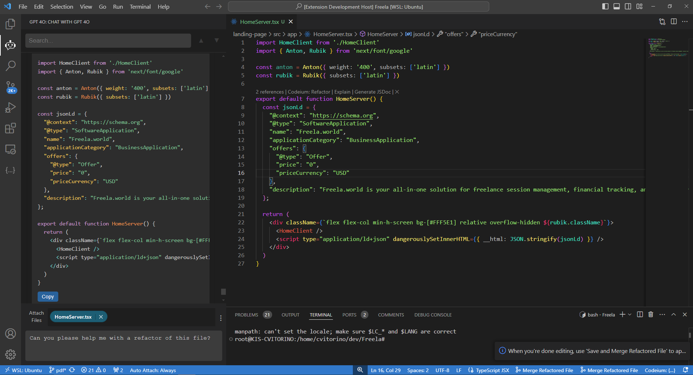

# GPT4o Code Assistant - Free Version

Unlock the power of AI-driven development with **GPT4o Code Assistant**! This VSCode extension brings the capabilities of OpenAI's GPT models directly into your coding environment. Whether you're looking to refactor code, ask questions, or generate new snippets, GPT4o provides intelligent, context-aware insights that enhance your coding productivity.

## Key Features

- **AI-Powered Chat Interface**: Engage in real-time conversations with GPT models directly from VSCode.
- **Contextual Code Understanding**: Attach open files to give GPT more context for deeper, code-specific insights.
- **Automated Code Refactoring**: Request refactoring and receive clean, optimized code suggestions with explanations.
- **Instant Prompt Copying**: Easily copy constructed prompts for use outside the extension or to further refine your queries.
- **Searchable Chat History**: Seamlessly navigate through your chat history to find previous interactions.
- **VSCode Theme Support**: Enjoy a user interface that adapts to your light or dark theme preference.

## How to Use

### 1. Installation
- **Step 1**: Install the extension from the VSCode marketplace (or manually from a `.vsix` file).
- **Step 2**: Add your OpenAI API key in the settings to activate GPT-powered interactions.
  
### 2. Setup Your API Key
- **Open Settings**: Go to `File > Preferences > Settings` (or press `Ctrl + ,`).
- **Search for**: `GPT4o Code Assistant API Key`.
- **Enter Your API Key**: Input your OpenAI API key to unlock the AI features.

### 3. Start Chatting with GPT4o
- **Access the Chat Interface**: Click on the GPT4o icon in the VSCode sidebar to open the chat panel.
- **Ask Questions**: Type your question in the chat input and hit `Enter`.
- **Attach Files for Context**: Use the file selector to attach open files for better AI-driven context in your queries.

### 4. Refactor Code
- **Request Refactoring**: Provide

### Screenshots

> This is an example of the chat interface with attached files for context-based AI interactions.

## Requirements

- **OpenAI API Key**: You will need an OpenAI API key to use the GPT features. You can get one by signing up on the [OpenAI website](https://openai.com/).
- **VS Code Version**: This extension requires Visual Studio Code version 1.50.0 or higher.

## Extension Settings

This extension contributes the following settings:

- `gpt4oChat.apiKey`: The OpenAI API key used to interact with GPT models.
- `gpt4oChat.defaultModel`: Set the default model (e.g., `gpt-4`, `gpt-3.5`) that the extension will use.
- `gpt4oChat.maxTokens`: Configure the maximum token count for GPT responses.

To configure these settings, go to the settings menu (`Ctrl+,` or `Cmd+,`) and search for "gpt4oChat".

## How to Use

1. **Open the Chat**: Open the chat view by selecting **GPT4o Chat** from the sidebar.
2. **Ask Questions**: Type your question or prompt into the input field.
3. **Attach Files**: Optionally, attach files from your open files to provide additional context for better answers.
4. **Submit**: Click the "Send" button or press Enter to submit your question.

## Known Issues

- **File Attachments**: Large workspaces with many files may cause performance issues when fetching the list of open files.
- **Rate Limits**: Be mindful of OpenAI API rate limits based on your account type. Excessive requests may result in delayed responses.

## Release Notes

### 1.0.0

- Initial release of GPT4o Chat.
- Basic GPT interaction and file attachment support.

### 1.1.0

- Added support for file attachments in open files.
- Enhanced UI to match VS Code's light/dark theme.

---

## Extension Guidelines

This extension follows [Visual Studio Code's extension guidelines](https://code.visualstudio.com/api/references/extension-guidelines) to ensure compatibility and performance.

## For more information

For more details about GPT models and AI integration, check out:

- [OpenAI GPT Documentation](https://beta.openai.com/docs/)
- [Visual Studio Code API Reference](https://code.visualstudio.com/api)

**Enjoy enhancing your coding experience with AI!**
